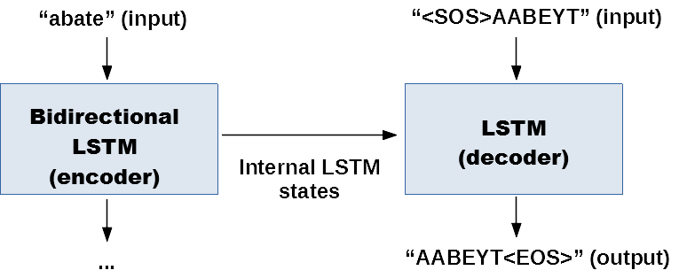

# Introduction^[All code and data available on GitHub.^[You can find the repository at <https://github.com/JasperHG90/phonorm>]]

```{r setup, include=FALSE}
knitr::opts_chunk$set(fig.pos="H", fig.width = 5, fig.height = 4,
                      echo = FALSE, warning = FALSE, message = FALSE,
                      fig.align = "center", eval=TRUE)
library(knitr)
library(kableExtra)
library(ggplot2)
```

Text normalization is the application of linguistic models to text with the aim of reducing tokens to a common form. For example, words may refer to the same underlying concepts but can be spelled in a different way. Examples of normalization are stemming and lemmatization. The former tries to map words to tokens by removing the suffix of a word (e.g. 'economy', 'economist' and 'economic' all map to 'econom'), and the latter approach attempts to bring back each token to its dictionary representation.

Phonetic normalization attempts to map similar-sounding words to a common form [@bisani_joint-sequence_2008]. Our interest in this topic is related to the development of our chatbot `ChitChat` [@halma_arvid_nodate], which we have implemented in for several international organizations in countries in which English is not the first language. One of our findings is that many of the conversations are characterized by a use of English that strongly resembles its phonetic form. For example, a sentence may contain the word 'aksiom', whereas the author means to write 'axiom'.

Due to the proliferation of social media messaging, there has been a surge of interest in phonetic normalization. Text found on social media such as Twitter, which is often referred to as *microtext*, has different challenges than regular, well-written text. It is characterized by a casual writing style, colloquial tone, relaxed spelling, reliance on emoticons, use of out of vocabulary (OOV) words such as acronyms and emphasis on emotional undercurrents for dramatic effect. [See e.g. @doval_performance_2018, @xue_normalizing_2011, @lopez-ludena_architecture_2012, @li_normalization_2012, @satapathy_phonetic-based_2017, @khoury_microtext_2015, @khoury_phonetic_2015]. While we find that the language used to converse with our chatbot bears some similarities to microtext, the language used is often more formal. This is an important distinction because strict phonetic normalization as we implement it is not suited for the informal style of microtext [see @doval_performance_2018].

In this paper, we present an approach to phonetic normalization that employs a standard encoder-decoder framework common to machine translation tasks. In this setting, the inputs are characters of English words, and the outputs are the pronunciations of these words in various formats. Hence, the goal of this paper is to show that a mapping can be learned from written to phonetic English by using character-level Recurrent Neural Networks (RNNs). One benefit of such an approach is that the mapping is learned without specific expertise about such a task. Examples of previous work with respect to text normalization and deep learning are  @min_ncsu_sas_wookhee:_2015, @chrupala_normalizing_nodate and @jaitly_rnn_2017].

This paper is structured as follows. (2) gives a short description of RNNs. (3) outlines the data sets, models and evaluation metrics used in our experiment. (4) interprets the results, and (5) concludes by offering several ways to improve the model. 

# Recurrent neural networks

Recurrent neural networks (RNN) are a type of neural network that model sequences such as series of words or characters. The RNN takes both an input vector, such as a sequence of input characters, as well as outputs that occur earlier in the sequence. Therefore, at timestep $t$, the results of timestep $t-1$ are fed into the network to learn patterns.

In principle, the length of the sequence is arbritrary, and the input length $T_x$ does not have to match the output length $T_y$. This is convenient for language modeling because, for example in the case of machine translation, an English sentence rarely has the same length as its counterpart in another language.

Like other models that consist of many layers, RNNs suffer from the 'vanishing gradient' problem. This means that they cannot represent long-range dependencies very well, and that, for example, a verb that occurs early in the sentence may not be 'memorized' until the end of the sentence, which renders the RNN unable to establish the connection between the verb and a noun or adjective that refers to it. This problem is addressed by making use of RNNs that are able to capture long-range dependencies such as Long Short-Term Memory (LSTM) layers or Gated Recurrent Units (GRU). [@hochreiter_long_1997, @cho_learning_2014]. In either one of these models, the model can be *unidirectional* or *bidirectional*. In the latter case, the model uses information from both earlier as well as later in the sequence to learn patterns [@schuster_bidirectional_1997].

# Data and models

This section describes the data used to train the models, and how the models are configured.

## Data

We consider two separate datasets that are subdivided into three categories:

### cmudict

This is a dataset containing $133.031$ words mapping English words a phonetic representation using ARPAbet phoneme set notation [@carnegie_mellon_university_cmu_nodate]. We remove words containing digits, special punctuation and special characters. The final dataset contains $123.612$ words. The data are subdivided into two data sets:

- *Multiple:* treats phonemes as individual characters. That is, a word like 'abate' is translated as 'AA B EY T' and would therefore contain the vocabulary entries 'AA', 'B', 'EY' and 'T'.  
- *Single:* in this case, the phonemes are ignored. Hence, the same word ('abate') now contains the vocabulary entries 'A', 'B', 'T', 'E', 'Y'.

This distinction between the datasets allow us to observe whether it is useful to retain the phonemes or not.

### Wiktionary

This is a dataset that is retrieved from the wiktionary dump file [@wikipedia_wikimedia_nodate]. We use the 'wikt2pron' python module [@xiong_toolkit_2018] to extract all English words from the dump from $01-11-2018$. The data contains $46.675$ words with pronunciations in XSAMPA format after removal of entries containing digits and special characters.

One downside of the wikt2pron module (or from the wiktionary data set) is that it does not distinguish between dialects. That is, the module returns a python dictionary for each word as well as up to $20$ pronunciation entries without specifying whether these are British-English, American-English or, for example, Australian-English. Clearly, this is an issue because British homophones do not map to American homophones one-to-one. For the purposes of this analysis, we simply pick the first entry for each word.

## Evaluation metrics

We evaluate the model on three separate metrics.

### BLEU score

The BLEU score [@papineni_bleu:_2002] is a measure of overlap between the predicted word and a reference that outputs a score between $0-1$, where a score of $0$ means that there is no overlap and $1$ means that there is perfect overlap.

Typically, the BLEU score is a combined metric measuring the overlap of one-grams, two-grams, three-grams and four-grams, each of which are weighted equally. Moreover, it takes into account the length of words (since shorter words are easier to predict). In this paper, we use the `sentence_bleu` function from the `nltk` python module [@bird_natural_2009]. We only present the cumulative 4-gram score (`BLEU-4`).

### Accuracy in detecting homophones

One way to the accuracy of our model is to evaluate its performance on words that sound the same but that are spelled in different ways. Such words are called *homophones*. We define three metrics to measure the performance of our models in detecting homophones, all of which are proportions. These three metrics are as follows:

1. **all equal**: the proportion of observations for which all homophones map to the same pronunciation.

Let $\theta_i$ be the value of the $i^{th}$ development set example. If all the predictions are equal, the value of $\theta_i = 1$, else, it equals $0$, then

$$
\tag{1}
p_{\text{ all equal}} = \frac{1}{n} \sum_{i=1}^n \theta_i
$$

2. **equal to reference**: the proportion of observations for which all homophones are equal to the reference.

If we let $\theta_i$ be the value of the $j^{th}$ word out of $k$ words in the $i^{th}$ development set example, which equals $1$ if the $j^{th}$ word equals the reference and $0$ otherwise, then:

$$
\tag{2}
p_{\text{ equal to reference}} = \frac{1}{n} \sum_{i=1}^n \left[ \frac{1}{k} \sum_{j=1}^k \theta_i \right]
$$

3. **largest subgroup**: the average of the largest sub-group of unique pronunciations for each example.

If we let $u$ equal the largest subgroup of $k$ possible subgroups, where $k$ is the number of words in the $i^{th}$ development set example. Furthermore, if we let $\theta_i$ be the value of the $j^{th}$ word out of $k$ words in the $i^{th}$ development set example, which equals $1$ if the $j^{th}$ word equals the value of the largest subgroup $u$ and $0$ otherwise, then

$$
\tag{3}
p_{\text{ largest subgroup}} = \frac{1}{n} \sum_{i=1}^n \left[\frac{1}{k} \sum_{j=1}^k \theta_i \right]
$$

These metrics measure related concepts. Clearly, a model that scores well on $p_{\text{equal to reference}}$ has a high detection rate for homophones, and at the same time the predictions are close to the actual pronunciation. For the purposes of this analysis, however, it is more important that the pronunciations are all equal to each other ($p_{\text{all equal}}$) than that they equal the actual pronunciation, as this metric still yields a good homophone detection rate while not imposing the strict condition that all predictions must be equal to the reference.

### Accuracy in recognizing similar-sounding misspelled words

As a third evaluation of the model, we consider the problem of mapping misspelled - but phonetically similar - words to their phonetic representation. We take a random subset of $100$ commonly misspelled words provided by Wikipedia [@wikipedia_wikipedia:lists_2018] and manually classify these words as either $1$ if the misspelled word should be phonetically similar to the correctly spelled word and $0$ otherwise. This dataset gives us an idea of the extent to which the models perform on unseen and unusual data. The metrics used to evaluate this data set are accuracy, sensitivity, specificity and the F1 score.

## Cross-validation

The data are split into several train and test sets. We first split the data based on homophones. This process works as follows: we first extract all homophones from the dataset, after which we select a subset as the test set. All words that map to the same pronunciation are then added to the test set. This ensures that the pronunciation is unseen during training.

To evaluate the general skill (BLEU score) of the model, we then split the train set into a generic train and test split.

## Models

This section describes the architecture of our models, all of which are trained using the python library `Keras` [@chollet_keras_2015].

### Hyperparameters and training

All models are trained using stochastic gradient descent and Adam [@kingma_adam:_2014] with minibatch size $128$. The optimization metric is the *log-likelihood*. We apply dropout and recurrent dropout [@gal_theoretically_2015] with a drop probability of $10$\% to both the encoder and decoder. We also use 'teacher forcing', meaning that instead of ingesting the predicted character generated at timestep $t-1$ to predict the next character in the sequence, we use the ground truth character [@lamb_professor_2016]. All models are trained for $10$ epochs on a single NVIDIA GTX 1060 with 6GB RAM.

```{r model details, eval=TRUE}
## Read model information directly from disk
path <- "../../models"
f <- list.files(path, recursive = TRUE)
f <- paste0(path, "/", f[grepl("fit_opts", f)])
fn <- strsplit(f, "/")
fn <- lapply(fn, function(x) strsplit(x[length(x)], "_")[[1]][1])

# Source python function
library(reticulate)
source_python("read_pickle.py")

# Read fit options
fit_opts <- lapply(f, read_pickle_file)

# Set names
names(fit_opts) <- fn

# To df
fit_opts_df <- do.call(rbind.data.frame, fit_opts) %>%
  dplyr::mutate(learning_rate = c(0.005, 0.005, 0.002)) %>%
  as.data.frame()

row.names(fit_opts_df) <- c("cmudict \n(multiple)", "cmudict \n(single)", "wiktionary")
# Make table
kableExtra::kable(fit_opts_df,
                  format = "latex",
                  col.names = c("batch\nsize", "epochs", "validation\nsplit", "hidden\ndimension", "learning\nrate"),
                  booktabs = TRUE,
                  caption = "Hyperparameters for final models") %>%
  kable_styling(latex_options = c("hold_position", "scale_down",
                                  "striped"))
```

### Encoder and decoder setup

The English words and their phonetic representation in our dataset are first converted to a one-hot-encoding (OHE). We then use a bidirectional LSTM that takes the OHE English words as input and that passes its internal state to the decoder. The decoder takes as its input the state vectors from the encoder as well as the OHE phonetic words. The decoder then generates the output sequence.

```{r model,  out.width="1\\linewidth", include=TRUE, fig.align="center", fig.cap=c("Encoder/decoder architecture"),fig.pos="H"}

```

# Results

```{r data loading, echo=FALSE}
# Load data
library(stringr)
library(purrr)
library(dplyr)
library(tidyr)
files <- list.files()
datasets <- files[str_detect(files, ".csv")]

# For each, load
data <- lapply(datasets, read.csv, header=TRUE, stringsAsFactors=FALSE)
# Names
names(data) <- str_replace(datasets, ".csv", "")

# Split into two datasets
x <- data
# Add identifier
for(x_n in names(x)) {
  x[[x_n]]$identifier <- x_n
}

# Subset
data_contains_hmp <- str_detect(names(x), "hmp")

# Subset where true
x_hmp <- x[data_contains_hmp] %>%
  bind_rows()

# Same for regular dev set
x_dev <- x[!data_contains_hmp] %>%
  bind_rows()
```

This section describes the results of the models. Figure $2$ below shows the average BLEU score for words of different lengths.

```{r skill (BLEU), eval=FALSE}
# Plot
library(ggplot2)

# Labels
labels <- c(
  "multichar_dev" = "cmudict \n(multiple)",
  "singlechar_dev" = "cmudict \n(single)",
  "xsampa_dev" = "wiktionary"
)

# Plot bleu score
x_dev %>%
  select(-X, -in., -out, -pred) %>%
  gather(key=bs, value, - identifier) %>%
  ggplot(., aes(x=value, fill=bs)) +
    geom_density(alpha=0.5) +
    theme_bw() +
    scale_x_continuous(name = "BLEU score") +
    scale_y_continuous(name = "Density") +
    scale_fill_brewer(palette = "Set3", name = "n-grams", labels = c("1-gram", "2-gram", "3-gram", "4-gram")) +
    theme(legend.position = "top") +
    facet_grid(identifier~., labeller = as_labeller(labels))
```

```{r word length and BLEU, fig.cap="Average BLEU score on development set"}
x_dev %>%
  mutate(wl = nchar(in.)) %>%
  filter(wl >= 4) %>%
  select(-X, -in., -out, -pred) %>%
  select(wl, bs4, identifier) %>%
  group_by(identifier, wl) %>%
  summarize(avgbs = mean(bs4)) %>%
  ggplot(., aes(x=wl, y=avgbs, color = identifier, linetype = identifier)) +
    geom_line(size=1.2, alpha=0.7) +
    scale_color_brewer(palette = "Set2", name = "Dataset", labels = c("cmudict \n(multiple)", "cmudict \n(single)", "wiktionary")) +
    scale_linetype_discrete(name = "Dataset", labels = c("cmudict \n(multiple)", "cmudict \n(single)", "wiktionary")) +
    theme_bw() +
    theme(legend.position = "top") +
    # Turn of linetype legend
    scale_x_continuous(name = "Number of Characters") +
    scale_y_continuous(name = "Avg. BLEU score")
```

```{r avgbleu}
avgbleu <- x_dev %>%
  group_by(identifier) %>%
  summarize(mbs = mean(bs4)) %>%
  mutate(mbsp = paste0(round(mbs, digits=4) * 100,
                       "%"))
```

The models trained on the `cmudict` data vastly outperform the `wiktionary` data. The `cmudict (single)` model achieves an average BLEU score of `r avgbleu$mbsp[2]`, which is slightly higher than the `cmudict (multiple)` model at `r avgbleu$mbsp[1]`.

Table $2$ below shows the performance of the models on the homophone test set. The `cmudict (single)` model outperforms the other models on all metrics. However, it is interesting that the models are much closer in terms of performance on the most import metric ($p_{\text{largest subgroup}}$) than on the other metrics. It should be noted that these metrics do not measure any possible erroneous mappings ('false positives'). Hence, it may be the case that the `wiktionary` model achieves this high score at the cost of making many more mistakes than the `cmudict` data.

```{r homophones, eval=TRUE}
scores <- x_hmp %>%
  select(-X, -in., -out, -equality, -pred) %>%
  gather(key, value, -identifier) %>%
  group_by(identifier, key) %>%
  summarize(score = mean(value)) %>%
  mutate(score=paste0(round(score, 4) * 100, "%")) %>%
  spread(key, score) %>%
  ungroup() %>%
  mutate(arr = order(gsub("%", "", props_comp_to_hmphones),
                     decreasing=TRUE)) %>%
  arrange(arr) %>%
  select(-identifier, -arr) %>%
  as.data.frame()

# Add row names
row.names(scores) <- c("cmudict (single)", "cmudict (multiple)", "wiktionary")

# Make table
kableExtra::kable(scores,
                  col.names = c("All equal", "Largest subgroup",
                                "Equal to reference"),
                  format = "latex",
                  booktabs = TRUE,
                  caption = "Percentage correct on each metric") %>%
  kable_styling(latex_options = c("hold_position", "scale_down",
                                  "striped"))
```

The accuracy across word length is similar across datasets, indicating that they perform well irrespective of the size of a word.

```{r homophones performance compared to length, fig.cap = "Average percentage correct (largest subgroup) across word length"}
x_hmp %>%
  mutate(l = nchar(out)) %>%
  group_by(identifier, l) %>%
  summarize(n = n(),
            avg = mean(props_comp_to_hmphones)) %>%
  filter(n >= 10) %>%
  ggplot(., aes(x=l, y=avg, color = identifier, linetype = identifier)) +
    geom_line(size=1.2, alpha=0.7) +
    scale_color_brewer(palette = "Set2",
                       name = "Dataset",
                       labels = c("cmudict \n(multiple)", "cmudict \n(single)", "wiktionary")) +
    scale_linetype_discrete(name = "Dataset",
                            labels = c("cmudict \n(multiple)", "cmudict \n(single)", "wiktionary")) +
    theme_bw() +
    theme(legend.position = "top") +
    scale_x_continuous(name = "Number of Characters") +
    scale_y_continuous(name = "Avg. percentage correct", limits = c(0, 1),
                       labels = scales::percent)

```

Finally, we consider the performance of the model on misspelled words. Given that roughly one-third of our manually labelled data is considered to be of the positive class^[indicating that the pronunciation of the mispelled word is the same as the word that was intended], we are most interested in the F1 and sensitivity scores obtained by the model.

```{r model performance misspelled words}
# order: cmudict (single), cmudict (mult), wiktionary
misp <- data.frame(
  "Accuracy" = c(0.94, 0.83, 0.76),
  "Sensitivity" = c(0.87, 0.77, 0.69),
  "Specificity" = c(0.92, 0.89, 0.87),
  "F1" = c(0.9, 0.83, 0.77)
)
# Add row names
row.names(misp) <- c("cmudict (single)", "cmudict (multiple)", "wiktionary")

# Print table
kableExtra::kable(t(misp),
                  format = "latex",
                  booktabs = TRUE,
                  caption = "Evaluation on misspelled data set") %>%
  kable_styling(latex_options = c("hold_position", "scale_down",
                                  "striped"))

```

As can be observed from table $2$, the `cmudict (single)` model again outperforms the others. It achieves significantly better scores than even the `cmudict (multiple)` model.

# Discussion and conclusion

The RNN approach to phonetic normalization is, as is shown above, succesful in its main objective. That is, the models succeed in creating sensible output, are good at mapping homophones to the same phonetic representation, and perform adequately on misspelled words. On all metrics, the `cmudict (single)` model outperforms the other models. This is a rather curious outcome, as one would expect the model that uses phonemes (`cmudict (multiple)`) to incorporate more information and hence perform better.

There are several improvements to be made to the model. Firstly, there must be some noise in the data because it is not-context aware. This means that the model cannot learn the difference between, for example, a word like 'tear' (to tear a piece of paper) or 'tear' (he teared up). This type of word is called a 'heteronym'. Adding this kind of context awareness must be gauged from the sentence somehow, given that the models described in this paper deal exclusively with words.

Furthermore, while the model performed adequately on the wikipedia data, it faces several bottlenecks. Firstly, the size of the vocabulary is not ideal. This issue could be exacerbated for languages other than English, as we expect the size of vocabularies to be smaller for other languages that are not as widely used on the internet. Secondly, more work should be done to filter different dialects or pronunciations from this data. As mentioned earlier, this project used available software to extract words from the wiktionary. This software does not distinguish between different pronunciations and hence we were not able to filter for, for example, American or British pronunciations.

Finally, we have implemented a rather traditional infrastructure. RNNs are resource-heavy from an architectural point of view. Other models (for example pure Attention models or models that employ convolutional layers) have been shown to perform as good or better while substantially reducing the resources needed to train the model.

# References
